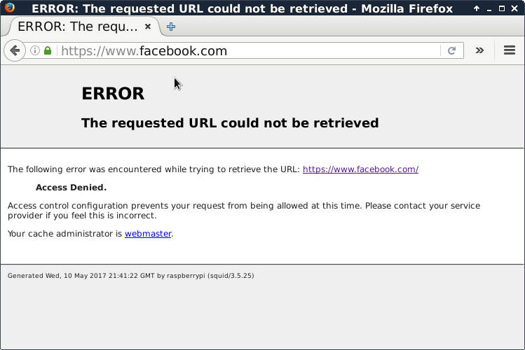
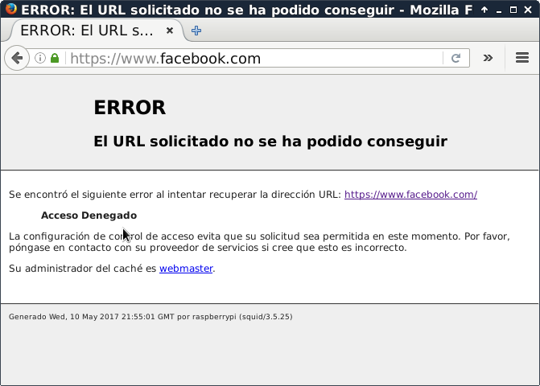

# Proxy cache

Un servidor proxy es un servidor que se encuentra entre el servidor remoto y el buscador de internet. Soporta protocolos como HTTP y puede almacenar y descargar documentos en su caché, de tal forma que el tiempo de conexión sea más rápido.

Squid es un servidor proxy cache para clientes, soporta FTP, gopher y HTTP. Sus dos principales objetivos son:
* Proporcionar servicio proxy de máquinas que deben pasar tráfico de internet.
* Almacenamiento en caché.

Cuando Squid recibe una solicitud de internet de un cliente, el servicio de filtrado la procesa. Si la solicitud cumple con alguna de las reglas establecidas entonces el sitio solicitado es bloqueado.

### Configuración de proxy
* Instalar dependencias
```bash
sudo apt-get install libssl-dev
```
* Instalar squid3 desde código fuente para habilitar el soporte de SSL, usando los modificadores `--with-openssl` y `--enable-ssl-crtd`.
```bash
# Descargar código fuente
wget http://www.squid-cache.org/Versions/v3/3.5/squid-3.5.25.tar.gz
# Descomprimir
tar -zxvf squid-3.5.25.tar.gz
cd squid-3.5.25
./configure --with-openssl --enable-ssl-crtd --with-default-user=squid --prefix=/usr/local/squid
make -j4
sudo make install
```
* Crear el usuario squid
```bash
sudo useradd squid
```
* Crear el directorio de cache de certificados TLS (para proxy de https)
```bash
sudo /usr/local/squid/libexec/ssl_crtd -c -s /var/lib/ssl_db
sudo chown squid:squid -R /var/lib/ssl_db
```
* Crear un certificado raíz
```bash
sudo mkdir /usr/local/squid/ssl_cert
sudo chown squid:squid -R /usr/local/squid/ssl_cert
sudo chmod 700 /usr/local/squid/ssl_cert
sudo -s
cd /usr/local/squid/ssl_cert
```
* Crear el certificado usando OpenSSL (responder a las pareguntas que hace)
```bash
openssl req -new -newkey rsa:2048 -sha256 -days 365 -nodes -x509 -extensions v3_ca -keyout myCA.pem  -out myCA.pem
```
* Generar un certificado DER para importarlo en los navegadores cliente
```bash
openssl x509 -in myCA.pem -outform DER -out myCA.der
```
* La configuración se realiza en el archivo **/usr/local/squid/etc/squid.conf**, abrir el archivo y buscar la linea que dice ***acl CONNECT method CONNECT***. Abajo de esa linea se define la ACL para nuestra red.
```bash
acl CONNECT method CONNECT
#ACL para nuestra red
acl mired src 192.168.23.0/255.255.255.0
```
* Buscar la sección que empieza con ***INSERT YOUR OWN RULE(S) HERE TO ALLOW ACCESS FROM YOUR CLIENTS*** y ahí permitir nuestra ACL.
```bash
#
# INSERT YOUR OWN RULE(S) HERE TO ALLOW ACCESS FROM YOUR CLIENTS
#
#Permitimos el accesso a esa ACL
http_access allow mired
```
* Creamos una unidad de systemd para que inicie el demonio de squid. `sudo nano /etc/systemd/system/mySquid.service` con el siguiente contenido.
```
[Unit]
Description=Inicio proxy squid
[Service]
Type=oneshot
ExecStart=/usr/local/squid/sbin/squid
ExecStop=/usr/local/squid/sbin/squid -k shutdown
RemainAfterExit=yes
[Install]
WantedBy=multi-user.target
```
* Habilitamos la unidad para que se inicie cuando se prende el sistema
```bash
systemctl enable mySquid.service
```

### Bloquear sitios web
* Para bloquear sitios vamos a crear un archivo que tenga las palabras a bloquear, `nano /usr/local/squid/bloquear/prohibidas`.
```bash
msn
taringa
microsoft
adobe
facebook
```
* En el archivo de configuración de squid, despues de la declaración de la ACL para nuestra red, se agrega una ACL para bloquar las palabras escritas en el archivo.
```bash
#ACL para bloquear los sitios no permitidos
acl prohibidos url_regex "/usr/local/squid/bloquear/prohibidas"
```
* En la sección de ***INSERT YOUR OWN RULE(S) HERE TO ALLOW ACCESS FROM YOUR CLIENTS*** bloquear el acceso a las palabras definidas en la ACL.
```bash
#
# INSERT YOUR OWN RULE(S) HERE TO ALLOW ACCESS FROM YOUR CLIENTS
#
# Acceso prohibido a los sitios definidos en "prohibidas"
http_access deny prohibidos
#Permitimos el accesso a esa ACL
http_access allow mired
```


### Proxy transparente

* El proxy puede configurarse de forma transparente, de modo que los clientes no deben hacer ninguna configuración en sus equipos.
* Abrimos el archivo de configuración y buscamos la linea ***http_port 3128*** y agregamos la palabra **intercept**
```bash
http_port 3128 intercept
```
* Con la linea anterior podemos hacer transparente el proxy para la petciones del protocolo HTTP, pero ignora las peticiones que usan HTTPS. Para manejar HTTPS debemos agregar otro puerto a squid el cual tendrá asociado el certificado que creamos con OpenSSL durante la instalació de Squid.
```bash
https_port 3129 intercept ssl-bump cert=/usr/local/squid/ssl_cert/myCA.pem generate-host-certificates=on dynamic_cert_mem_cache_size=4MB
ssl_bump none localhost
ssl_bump server-first all
sslcrtd_program /usr/local/squid/libexec/ssl_crtd -s /var/lib/ssl_db -M 4MB
sslcrtd_children 5
```
* Instalar el paquete iptables para redirigir el trafico a los puertos definidos en squid.
```bash
sudo apt-get install iptables
```
* El siguiente comando redirige todas las peticiones del puerto 80 al puerto 3128 (squid3).
```bash
iptables -t nat -A PREROUTING -i wlan0 -p tcp -m tcp --dport 80 -j REDIRECT --to-ports 3128
iptables -t nat -A PREROUTING -i wlan0 -p tcp -m tcp --dport 443 -j REDIRECT --to-ports 3129
```

### Personalizar mensajes de error
* Por defecto squid muestra las páginas de error en inglés, para modificar el idioma se puede configurar el directorio de los mensajes de error. Creamos el directorio donde pondremos las páginas en español:
```bash
mkdir /usr/local/squid/pages
```
* Copiamos al directorio, las páginas en español del paquete de idiomas de squid.
```bash
cp -r /usr/share/squid-langpack/es-mx/* /usr/local/squid/pages
```
* Agregamos la siguiente linea al archivo de configuración
```bash
error_directory /usr/local/squid/pages/
```
para que muestre el mensaje en español.

