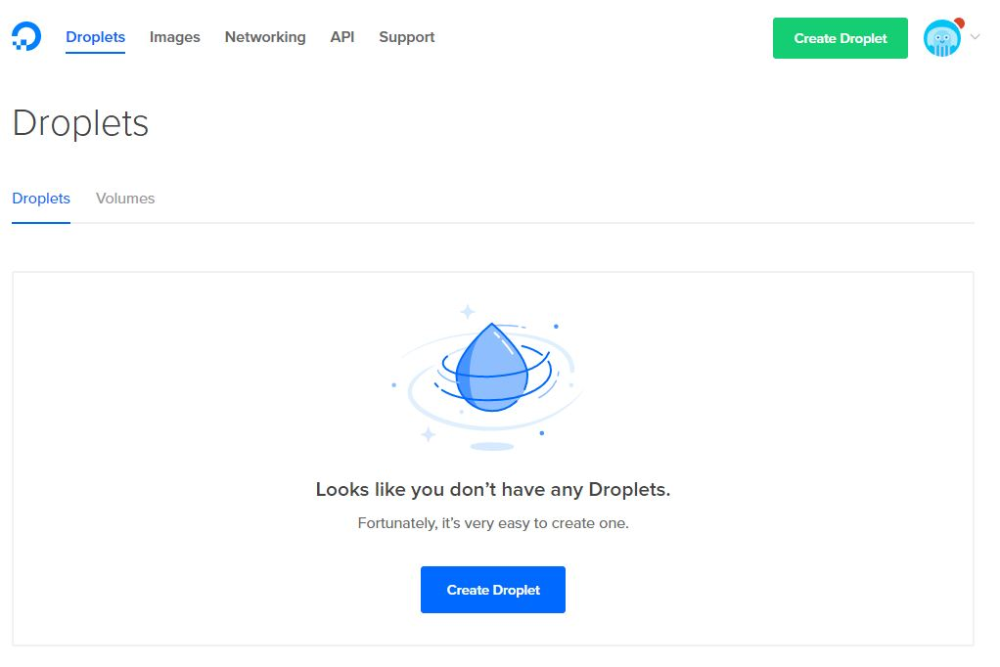
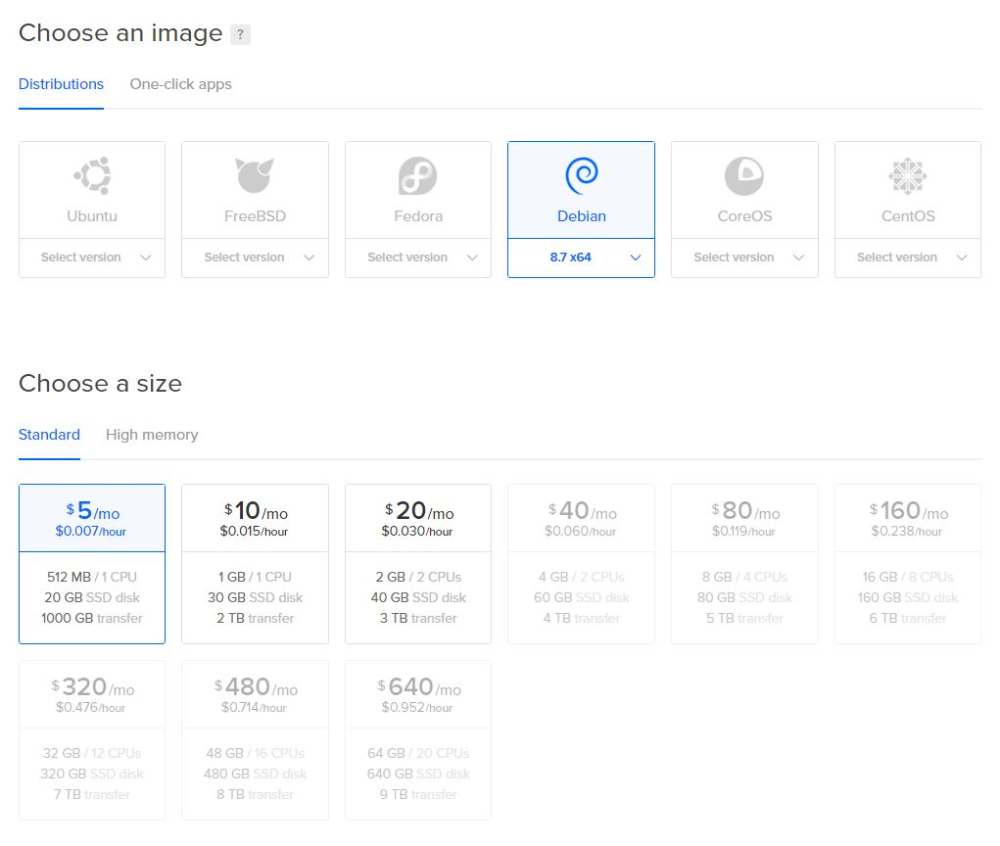
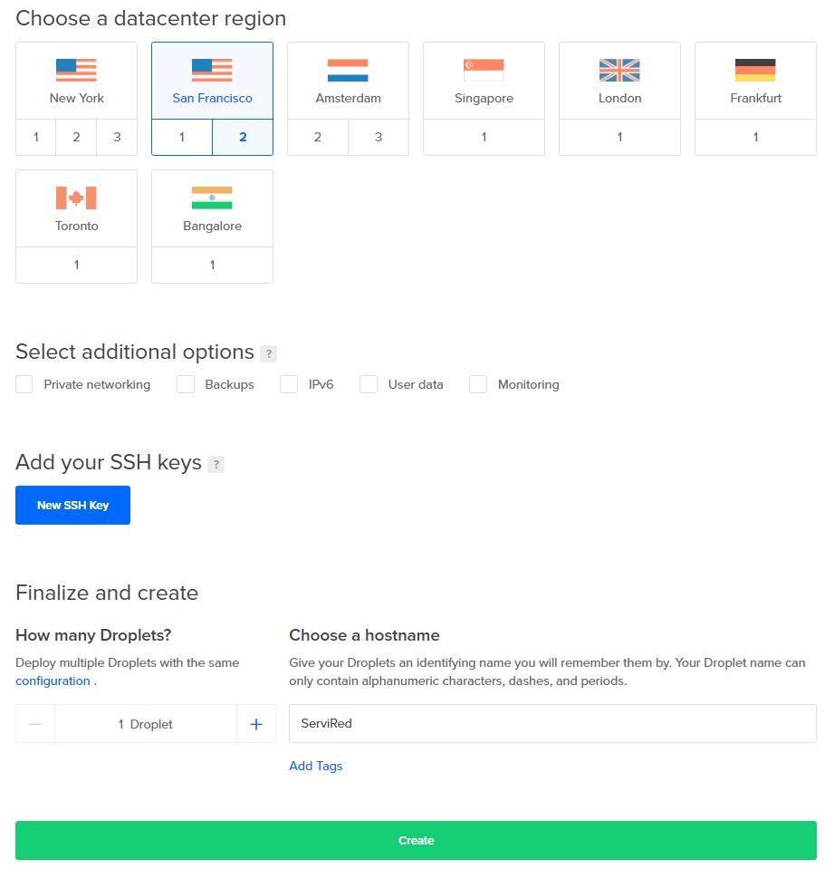
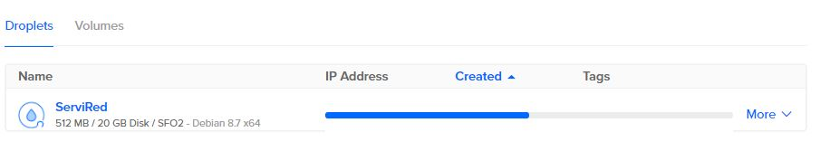
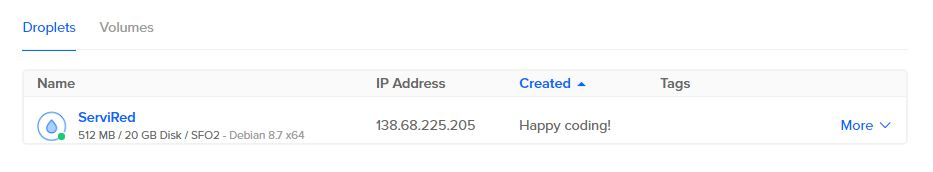
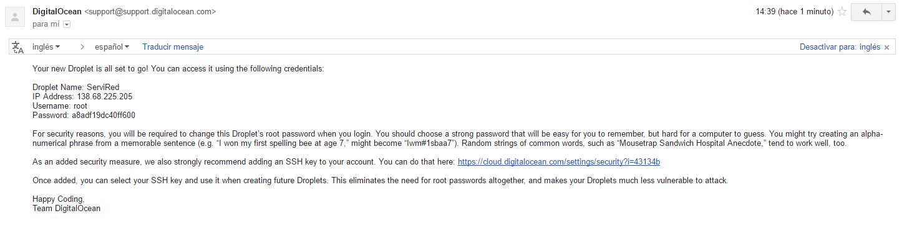

# Servicios Web

Un servicio web permite a un proovedor compartir una funcionalidad a través de la red. Un servicio web tiene dos propiedades:
* Es autodescriptivo
* Descubrible

## Creación de servidor virtual

Digital Ocean es un proovedor de servidores virtuales privados (VPS) basados en Linux llamados droplets. Para crear un servidor virtual se siguen los siguientes pasos:

1. Iniciar sesión en Digital Ocean. Seleccionar la opción ```Create Droplet```



2. Seleccionar el SO del droplet y el paquete que más se adecúe a nuestras necesidades.


3. Seleccionar la ubicación del droplet y seleccionar el botón ```Siguente```


4. Esperar mientras termina la creación del droplet.



5. Una vez creado el droplet se recibe una notificación con los datos del droplet que se acaba de crear.


## Apache

Apache es un servidor web HTTP de código abierto para plataformas Unix (BSD, GNU/Linux, etc), Microsoft Windows, Macintoch y otras que implementa el protocolo HTTP/1.11. Es un servidor altamente configurable sin interfaz gráfica. Entre sus principales ventajas se encuentran:
* Modularidad.
* Código abierto.
* Multi-plataforma.
* Extensible
* Popular (Documentación/soporte)

### Instalación y configuración de Apache

* Instalación de paquetes necesarios
```
$ sudo apt-get update
$ sudo apt-get upgrade
$ sudo apt-get install apache2
```

* Se comprueba la configuración de apache para los errores de sintaxis
```
$ sudo apache2ctl configtest
```

* Reiniciar Apache
```
$ sudo systemctl restart apache2
```

## Configuración de host virtual

* Una vez que se tiene instalado Apache se crea la estructura del directorio. En este caso se crean dos servidores virtuales debido a que habrá dos dominios distintos:
```
$ sudo mkdir -p /var/www/eroland.me/public_html
$ sudo mkdir -p /var/www/clandestina-hds.com/public_html
```

* Cambiar permisos a los directorios anteriores
```
$ sudo chown -R eroland:eroland /var/www/eroland.me/public_html
$ sudo chown -R clandestina:clandestina /var/www/clandestina-hds.com/public_html
```

* Habilitar el acceso de lectura
```
$sudo chmod -R 755 /var/www
```

* Crear una página de prueba para cada sitio y guardarla:

```
/var/www/eroland.me/public_html/index.html
```
El archivo ``` ìndex.html ``` será usado como base para cada uno de los sitios.

* Crear un archivo de configuración  ``` 000-default.conf ``` para indicar a Apache como gestionar las solicitudes.

```
$ sudo cp /etc/apache2/sites-available/000-default.conf /etc/apache2/sites-available/eroland.me.conf
```

* Editar el archivo anterior con permisos de root, debe tener las siguientes directivas:

```
<VirtualHost *:80>
        ServerName eroland.me
        ServerAlias www.eroland.me
        ServerAdmin webmaster@localhost
        DocumentRoot /var/www/eroland.me/public_html
        ErrorLog ${APACHE_LOG_DIR}/error.log
        CustomLog ${APACHE_LOG_DIR}/access.log combined
</VirtualHost>
```

```ServerName``` Indica cuál es el dominio base que coincidirá con el servidor virtual.

``` ServerAlias ``` Se establecen nombres alternativos del dominio base.

``` ServerAdmin ```  Es donde el administrador del sitio recibirá correos.

``` DocumentRoot ``` Indica la ubicación del archivo raiz dentro del servidor virtual

El archivo de configuración anterior será la base para cada sitio, sólo modificando las directivas anteriormente mencionadas.

* Habilitar los archivos del virtual host,para lo cual se usa la herramienta  ```a2ensite``` aplicada a cada uno de los sitios.
```
$ sudo a2ensite eroland.me.conf
```

A continuación se deshabilita el sitio definido en ```000-default.conf```
```
$ sudo a2dissite 000-default.conf
```
Se reinicia el servicio de Apache
```
$ sudo systemctl restart apache2
```

## Creación de certificado

Para habilitar el protocolo HTTPS en el servidor web es necesario tener un certificado de una Autoridad de Certificación (CA). Let's encrypt  en un CA de la compañía Electronic Frontier Foundation (EFF) que proporciona certificación SSL d emanera gratuita.

Un certificado SSL en un conjunto de archivos que de manera digital unen una clave criptográfica con las organizaciones. Los certificados SSL son usados por servidores web para encriptar el tráfico entre el cliente y el servidor, de manera tal que la información viaje segura.

Certbot es un paquete que automatiza tareas de obtener certificados y configurar servidores web para usarlos.

### Instalación de Certbot

* Agregar el repositorio certbot.
```
$ sudo add-apt-repository ppa:certbot/sertbot
```

* Actualizar la lista de paquetes e instalar Certbot
```
$ sudo apt-get update
$ sudo apt-get install python-certbot-apache
```
* Para generar el certificado SSL se ejecuta el comando:
```
$ sudo certbot --apache -d eroland.me -d www.eroland.me
```
Una vez que la instalación terminó se puede verificar la generación de los mismos en ```/etc/letsencrypt/live```. Se observará algo parecido como lo que se muestra a continuación:
```
root@erodrop:/etc/letsencrypt/live# ls
clandestina-hds.com  eroland.me
root@erodrop:/etc/letsencrypt/live# ls eroland.me/
cert.pem  chain.pem  fullchain.pem  privkey.pem  README
```

```cron``` es un demonio que permite la ejecución periódica de ciertas tareas. El archivo ```crontab``` contiene la hora y la peridiocidad de ejecución de los procesos.

Volviendo al tema de certificado SSL y Certbot, por razones de seguridad el certificado dura sólo 90 días, por lo tanto cada 90 días será necesario realizar los comandos anteriores.

Para renovar el certificado se ejecuta el comando:
```
/usr/bin/certbot renew
```
Si éste comando es ejecutado y aún no han pasado los 90 días aparecerá un mensaje como el siguiente:
```
/usr/bin/certbot renew
The following error was encountered:
[Errno 13] Permission denied: '/var/log/letsencrypt/.certbot.lock'
If running as non-root, set --config-dir, --work-dir, and --logs-dir to writeable paths.
clandestina@erodrop:/$ sudo /usr/bin/certbot renew
Saving debug log to /var/log/letsencrypt/letsencrypt.log

-------------------------------------------------------------------------------
Processing /etc/letsencrypt/renewal/eroland.me.conf
-------------------------------------------------------------------------------
Cert not yet due for renewal

-------------------------------------------------------------------------------
Processing /etc/letsencrypt/renewal/clandestina-hds.com.conf
-------------------------------------------------------------------------------
Cert not yet due for renewal

The following certs are not due for renewal yet:
  /etc/letsencrypt/live/eroland.me/fullchain.pem (skipped)
  /etc/letsencrypt/live/clandestina-hds.com/fullchain.pem (skipped)
No renewals were attempted.
```

Por lo tanto, se deja a ```cron``` la tarea de diariamente realizar la verificación de la validez del certificado. Para programar la tarea se ejecuta el comando ```$ sudo crontab -e``` y se escribe la tarea.
```
#m h  dom mon dow   command
15 3 * * * /usr/bin/certbot renew --quiet
```
El comando anterior intentará verificar todos los días a las 3 hrs. con 15 minutos con el comando ```/usr/bin/certbot renew --quiet```
