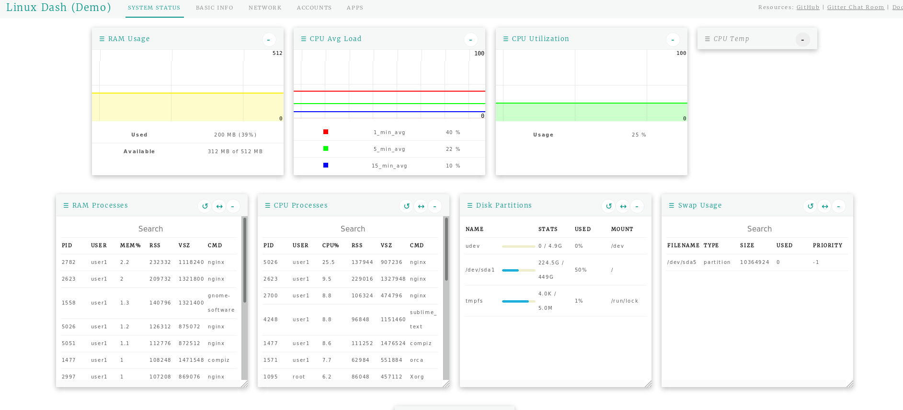

## Linux Dash

Linux Dash es un dashboard open-source para el monitoreo de servidores Linux. Es muy simple y proporciona facilidad de uso. Puede ser instalado mediante PHP, Go o Node.js.

### Prerequisitos

En este caso se instalará linux dash usando Node.js por lo que solo se necesita tener instalado Node.js.

### Instalación de Linux Dash
* Clonar el repositorio de Github de Linux Dash
```bash
git clone --depth 1 https://github.com/afaqurk/linux-dash.git
```

* Entrar al repositorio clonado usando la ruta *linux-dash/app/server*
```bash
cd linux-dash/app/server
```

* Instalar las dependencias
```bash
npm install --production
```

* Instalar PM2, el cual es un manejador de procesos para aplicaciones de Node.js. PM2 proporciona una manera facil de manejar y demonizar aplicaciones (correrlas como demonios).
```bash
sudo npm install -g pm2
```

* Iniciar la aplicaciones con PM2
```bash
pm2 start index.js --name linuxdash -- --port=3000
```

`--name` sirve para especificar el nombre del demonio

`-- --port=3000` específica que LinuxDash estará escuchando en el puerto 3000.

El resultado será similar al siguiente:
```bash
eroland@erodrop:~/linux-dash/app/server$ pm2 start index.js --name linuxdash -- --port=3000
[PM2] Starting /home/eroland/linux-dash/app/server/index.js in fork_mode (1 instance)
[PM2] Done.
┌───────────┬────┬──────┬───────┬────────┬─────────┬────────┬─────┬───────────┬──────────┐
│ App name  │ id │ mode │ pid   │ status │ restart │ uptime │ cpu │ mem       │ watching │
├───────────┼────┼──────┼───────┼────────┼─────────┼────────┼─────┼───────────┼──────────┤
│ linuxdash │ 0  │ fork │ 25180 │ online │ 0       │ 0s     │ 0%  │ 14.9 MB   │ disabled │
└───────────┴────┴──────┴───────┴────────┴─────────┴────────┴─────┴───────────┴──────────┘
 Use `pm2 show <id|name>` to get more details about an app
```

* Ahora se puede acceder a Linus Dash mediante la url eroland.me:3000


