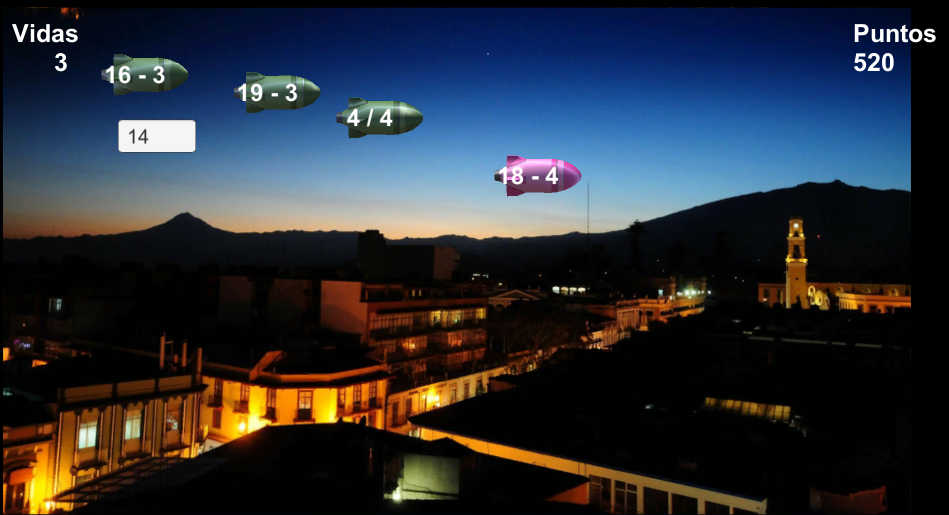

# Misiles matemáticos

Misiles matemáticos es un video juego serio cuyo objetivo principal es aumentar las habilidades cognitivas mediante ´calculos matemácticos. El juego tiene lugar en la bella y hermosa ciudad de Xalapa, cuando una noche tranquila de pronto comienzan a invadirla. Del cielo caen misiles que pueden ser desactivados ingresando el código correcto, el cuál es la respuesta del cálculo matemático.



Conforme pasa el tiempo, los misiles comienzan a caer más rápido, pero en las líneas enemigas se encuentra un infiltrado Xalapeño que envía misiles amigos. Los misiles amigos tienen como característica que al ser ingresado su código elimina a todos los misiles enemigos que se encuentren alrededor.

La hermosa ciudad de Xalapa sólo es capaz de soportar 3 ataques, ésta noche ¿quién será nuestro héroe?

En el siguiente enlace puede jugarse la versión web del juego, por razones desconocidas los misiles amigos no funcionan en ésta versión
```
https://clandestina-hds.com/proyFinalWeb/
```
En el siguiente enlace se puede descargar una versión de escritorio para MacOS
```
https://clandestina-hds.com/mac.zip
```

En el siguiente enlace se puede descargar una versión de escritorio para Windows
```
https://clandestina-hds.com/proyEjecutable/
```

## Agregando servicio a servidor web
* El juego anterior fue desarrollado en Unity y para montarlo en el servidor web el proyecto del juego ejecuta el comando:
```
$ scp proyFinalWeb.zip clandestina@clandestina-hds.com:~
```

* Se ingresa al servidor por medio de ssh
```
$ ssh clandestina@clandestina-hds.com
```
* Se copia el archivo del juego en el servidor apache y se descomprime.

```
$ cp proyFinalWeb.zip /var/www/clandestina-hds.com/public_html
$ unzip /var/www/clandestina-hds.com/public_html/proyFinalWeb.zip
```
