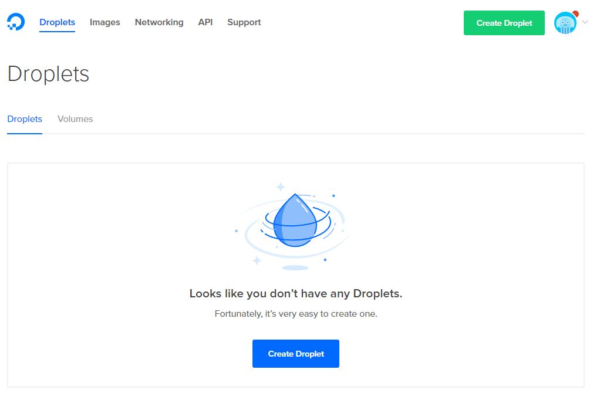
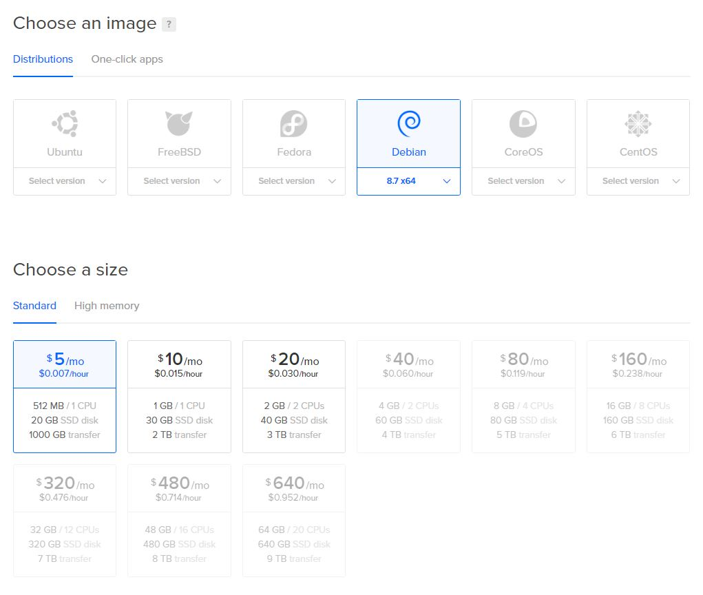
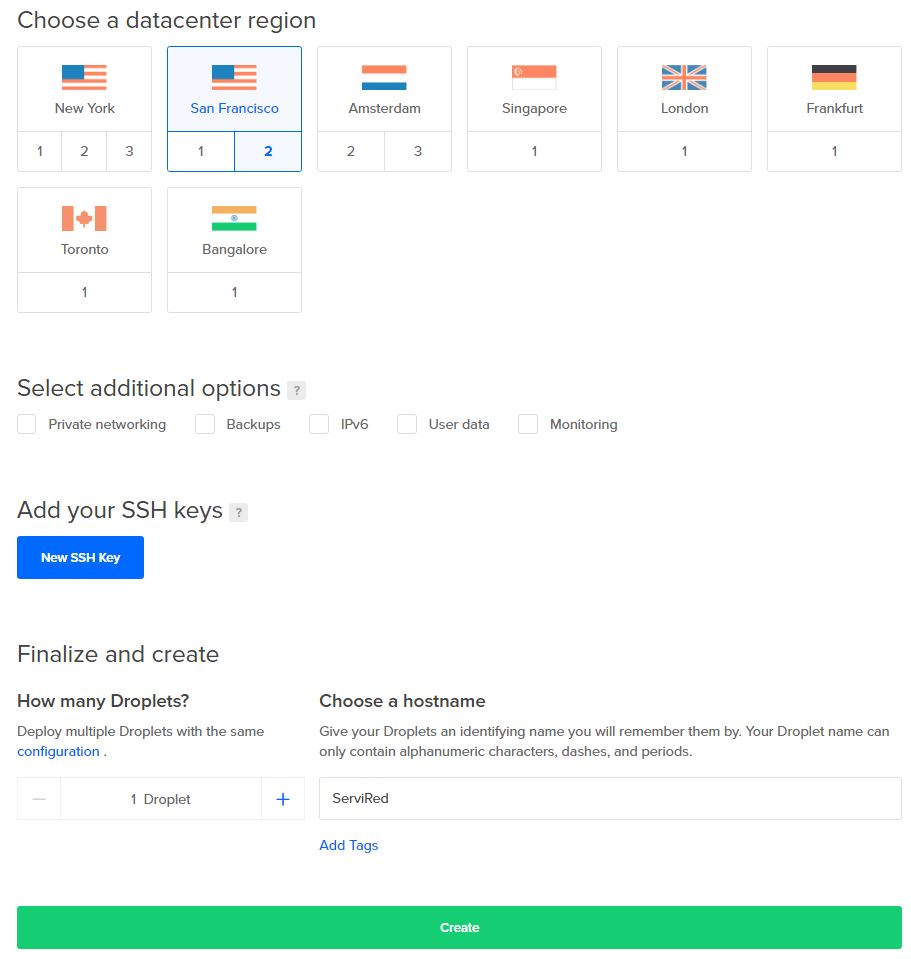

# Titulo

Un servicio web permite a un proovedor compartir una funcionalidad a través de la red. Un servicio web tiene dos propiedades:
* Es autodescriptivo
* Descubrible

## Creación de servidor virtual

Digital Ocean es un proovedor de servidores virtuales privados (VPS) basados en Linux llamados droplets. Para crear un servidor virtual se siguen los siguientes pasos:

1. Iniciar sesión en Digital Ocean. Seleccionar la opción ```Create Droplet```



2. Seleccionar el SO del droplet y el paquete que más se adecúe a nuestras necesidades.


3. Seleccionar la ubicación del droplet y seleccionar el botón ```Siguente```


4. Esperar mientras termina la creación del droplet.


5. Una vez creado el droplet se recibe una notificación con los datos del droplet que se acaba de crear.


## Apache

Apache es un servidor web HTTP de código abierto para plataformas Unix (BSD, GNU/Linux, etc), Microsoft Windows, Macintoch y otras que implementa el protocolo HTTP/1.11. Es un servidor altamente configurable sin interfaz gráfica. Entre sus principales ventajas se encuentran:
* Modularidad.
* Código abierto.
* Multi-plataforma.
* Extensible
* Popular (Documentación/soporte)

### Instalación y configuración de Apache

* Instalación de paquetes necesarios
```
$ sudo apt-get update
$ sudo apt-get upgrade
$ sudo apt-get install apache2
```

* Se comprueba la configuración de apache para los errores de sintaxis
```
$ sudo apache2ctl configtest
```

* Reiniciar Apache
```
$ sudo systemctl restart apache2
```

## Configuración de host virtual

* Una vez que se tiene instalado Apache se crea la estructura del directorio. En este caso se crean dos servidores virtuales debido a que habrá dos dominios distintos:
```
$ sudo mkdir -p /var/www/eroland.me/public_html
$ sudo mkdir -p /var/www/clandestina-hds.com/public_html
```

* Cambiar permisos a los directorios anteriores
```
$ sudo chown -R eroland:eroland /var/www/eroland.me/public_html
$ sudo chown -R clandestina:clandestina /var/www/clandestina-hds.com/public_html
```

* Habilitar el acceso de lectura
```
$sudo chmod -R 755 /var/www
```

* Crear una página de prueba para cada sitio y guardarla:

```
/var/www/eroland.me/public_html/index.html
```
El archivo ``` ìndex.html ``` será usado como base para cada uno de los sitios.

* Crear un archivo de configuración  ``` 000-default.conf ``` para indicar a Apache como gestionar las solicitudes.

```
$ sudo cp /etc/apache2/sites-available/000-default.conf /etc/apache2/sites-available/eroland.me.conf
```

* Editar el archivo anterior con permisos de root, debe tener las siguientes directivas:

```
<VirtualHost *:80>
        ServerName eroland.me
        ServerAlias www.eroland.me
        ServerAdmin webmaster@localhost
        DocumentRoot /var/www/eroland.me/public_html
        ErrorLog ${APACHE_LOG_DIR}/error.log
        CustomLog ${APACHE_LOG_DIR}/access.log combined
</VirtualHost>
```

```ServerName``` Indica cuál es el dominio base que coincidirá con el servidor virtual.

``` ServerAlias ``` Se establecen nombres alternativos del dominio base.

``` ServerAdmin ```  Es donde el administrador del sitio recibirá correos.

``` DocumentRoot ``` Indica la ubicación del archivo raiz dentro del servidor virtual

El archivo de configuración anterior será la base para cada sitio, sólo modificando las directivas anteriormente mencionadas.

* Habilitar los archivos del virtual host,para lo cual se usa la herramienta  ```a2ensite``` aplicada a cada uno de los sitios.
```
$ sudo a2ensite eroland.me.conf
```

A continuación se deshabilita el sitio definido en ```000-default.conf```
```
$ sudo a2dissite 000-default.conf
```
Se reinicia el servicio de Apache
```
$ sudo systemctl restart apache2
```

## Creación de certificado

Los certificados SSL son usados por servidores web para encriptar el tráfico entre el cliente y el servidor, de manera tal que la información viaje segura. Certbot es un paquete

* Se agrega el repositorio
```
$ sudo add-apt-repository ppa:certbot/sertbot
```

* ACtualizar la lista de paquetes e instalar Certbot
```
$ sudo apt-get update
$ sudo apt-get install python-certbot-apache
```
