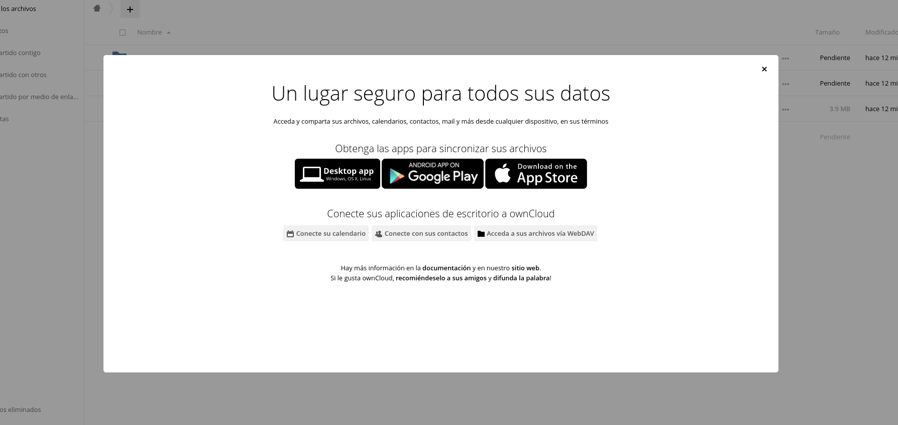

## Owncloud
ownCloud es un servidor de archivos compartidos que permite alamcenar contenido personal,
como documentos, imagenes, etc, en una localización centralizada (como Dropbox).
ownCloud es un proyecto libre open source y representa una alternativa al uso de
herramientas de almacenamiento en la nube privativas.

### Instalación de ownCloud
* Agregar la clave al repositorio de claves
```bash
sudo curl https://download.owncloud.org/download/repositories/stable/Ubuntu_16.04/Release.key | sudo apt-key add -
```
* Agregar el repostitorio de ownCloud a la lista de repositoios de nuestro servidor.
```bash
echo 'deb https://download.owncloud.org/download/repositories/stable/Ubuntu_16.04/ /' | sudo tee /etc/apt/sources.list.d/owncloud.list
```
* Actuzalizar la lista de paquetes
```bash
sudo apt-get update
```
* Instalar ownCloud
```bash
sudo apt-get install owncloud
```
*  Reiniciar nuestro servidor web
```bash
sudo systemctl reload apache2
```
* Configurar la base de datos para ownCloud
* Iniciar sesión en mysql usando el usuario root
```bash
mysql -u root -p
```
* Crear una base de datos para owncloud
```bash
CREATE DATABASE owncloud;
```
* Crear una cuenta de usuario para ownCloud.
```bash
GRANT ALL ON owncloud.* to 'owncloud'@'localhost' IDENTIFIED BY 'ownpass';
```
* Finalizar la asignación de privilegios
```bash
FLUSH PRIVILEGES;
```
* Salir de mysql
```bash
exit
```
### Configuración de ownCloud
Ahora ya tenemos instalado ownCloud, podemos entrar a la interfaz web mediante la url (cambiar el nombre de dominio):
```
https://eroland.me/owncloud
```
Se mostrará la página de configuración para ownCloud

En dicha página crear el usuario administrador y en la parte de abajo en la sección
*configurar la base de datos* escribir los datos de la base de datos que se creó
durante la instalación de ownCloud.

Finalmente se puede ingresar a ownCloud.

